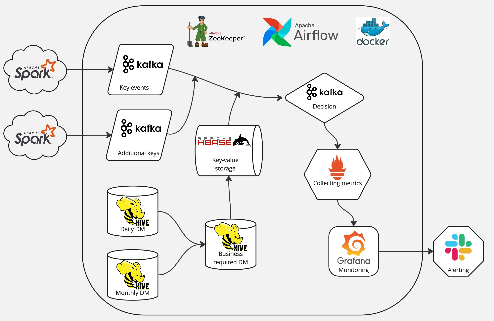

#Project Overview

This project provides a data ecosystem infrastructure, including Kafka, HBase, Hadoop, Hive, Spark, Prometheus, and Grafana, using Docker Compose. The goal is to create a local environment for developing, testing, and showcasing data processing systems.

#Tech Stack
- Kafka: Distributed platform for data streaming.
- HBase: Distributed column-oriented database.
- Hadoop (HDFS): File system for big data storage.
- Hive: SQL-oriented tool for querying data in HDFS.
- Spark: Distributed computing platform for data processing.
- Prometheus: Monitoring and alerting toolkit.
- Grafana: Visualization platform for monitoring metrics.
- Airflow: Workflow orchestration and automation tool.

#Schema

