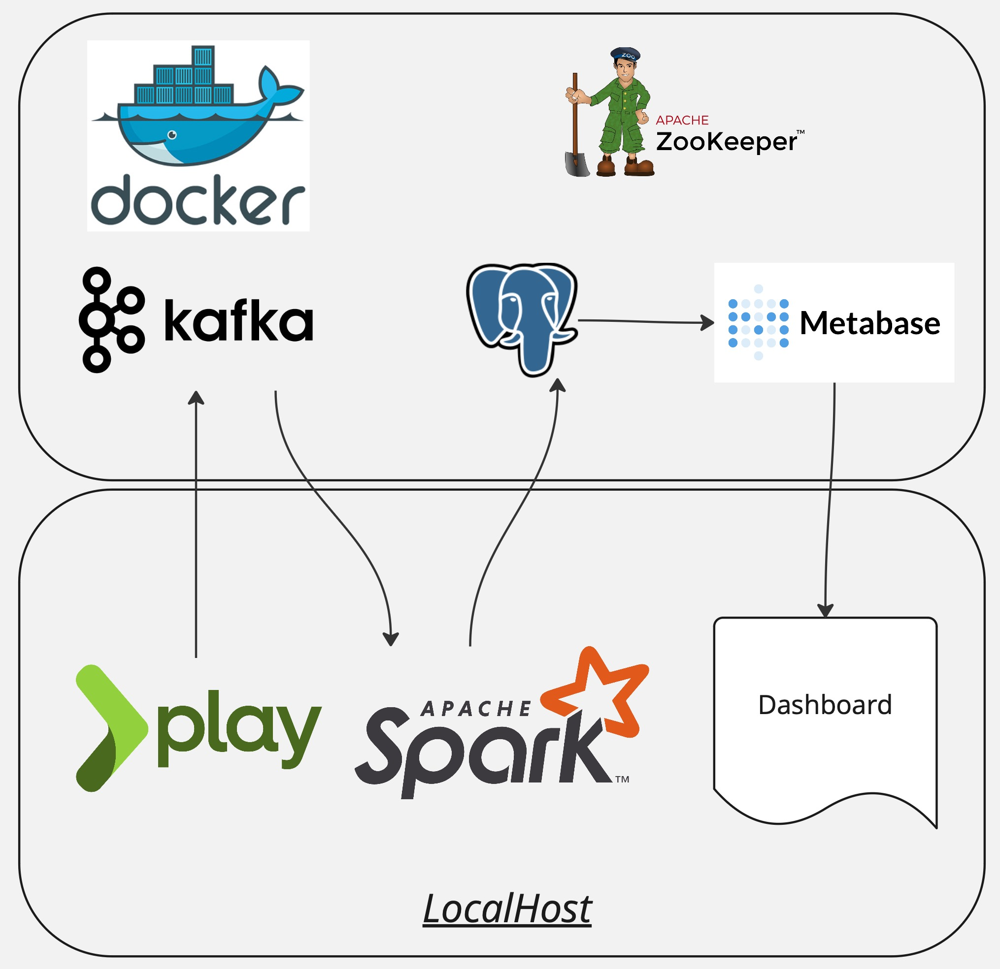

# Play -> Kafka -> Spark -> Postgres -> Metabase 

This project demonstrates a streaming application where Kafka messages are processed using Apache Spark and results are stored in PostgreSQL. The processed data can then be visualized using Metabase, while a Play Framework-based web interface provides a chat feature for message input.

## Overview

The project consists of the following components:
1. **Zookeeper**: Manages Kafka brokers.
2. **Kafka**: Message broker for producing and consuming messages.
3. **PostgreSQL**: Database for storing processed messages.
4. **Metabase**: Data visualization tool for creating dashboards.
5. **Apache Spark**: For processing streaming data from Kafka.
6. **Play Framework**: Web-based chat interface to produce Kafka messages.


Open the chat interface in your browser at http://localhost:9000/chat.

Open Metabase in your browser at http://localhost:3000. Complete the setup, connect to the PostgreSQL database, and create the required dashboards.

Kafka topic checking:
```bash
docker exec -it chat-analytics-kafka-1 /bin/sh -c "exec kafka-console-producer --bootstrap-server localhost:9092 --topic my_topic"

docker exec -it chat-analytics-kafka-1 /bin/sh -c "exec kafka-console-consumer --bootstrap-server localhost:9092 --topic my_topic --from-beginning"
```


Feel free to reach out to me directly for more details.

P.S. The word list for testing:

- This is just a normal message
- What the hell is going on here?
- Du bist ein verdammter Idiot!
- C'est une journée magnifique, mais putain il fait chaud.
- La mierda de hoy no vale nada.
- Why are you being such an asshole?
- Scheiße! Ich habe meinen Schlüssel vergessen.
- Je t'ai dit de ne pas faire ça, connard!
- ¡Coño! ¿Dónde está mi cartera?
- You're such a wonderful person, really!
- Verdammt noch mal, das war knapp
- Oh non, quel bordel dans cette chambre!
- Esto es una puta locura, ¿verdad?
- I'm so happy for you, congratulations!
- Das ist ein wunderschöner Tag
- Je suis tellement fatigué aujourd'hui
- No sé qué hacer ahora mismo
- What a lovely day, isn't it?
- Heute ist ein schöner Tag
- Bonjour, comment ça va?